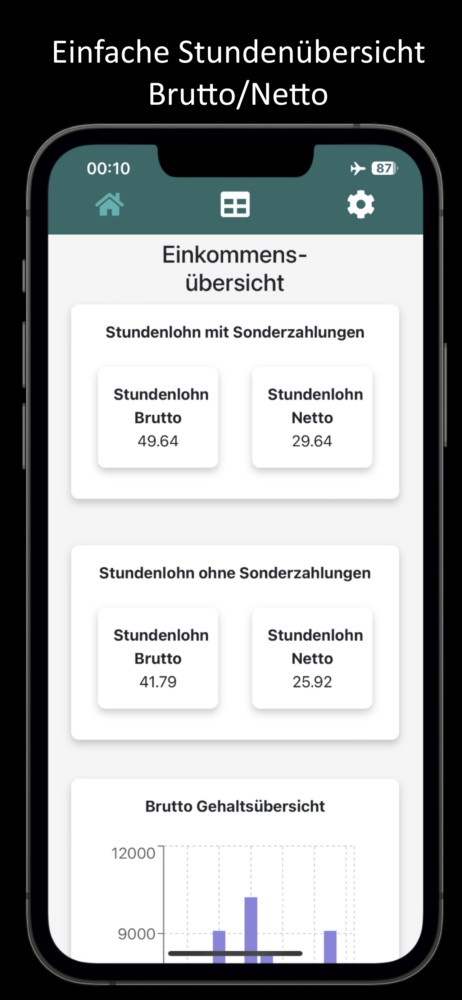
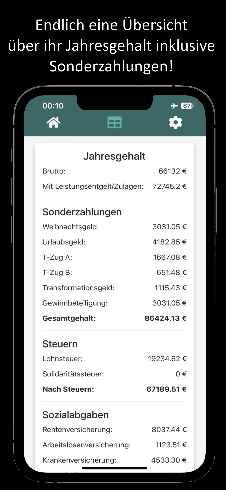
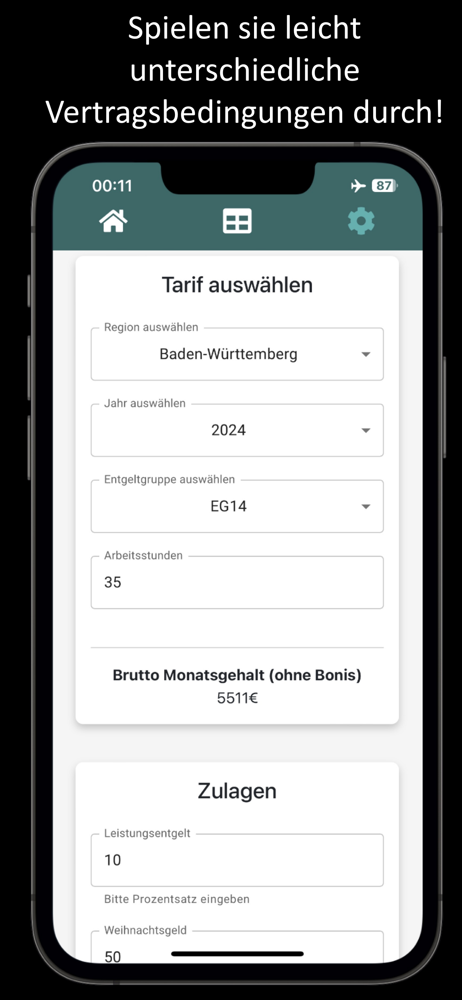
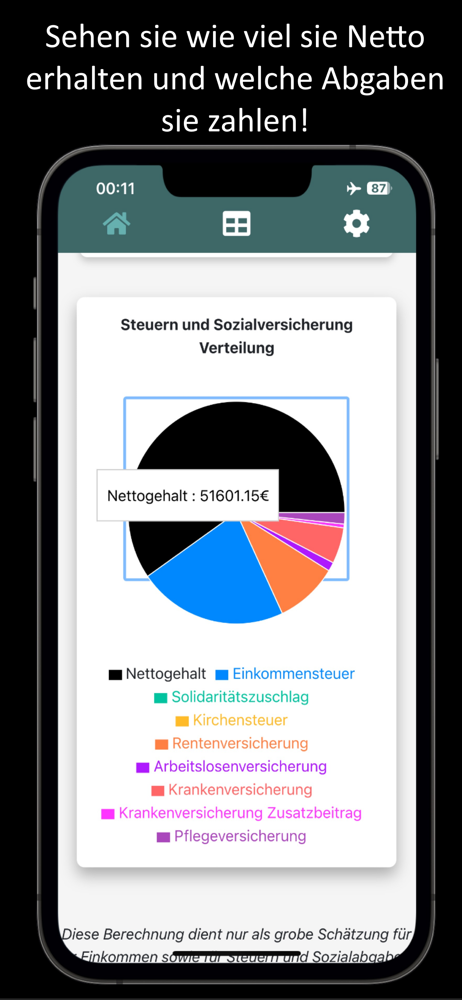
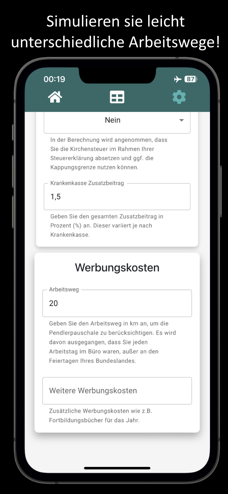

# UnionCalculator IGM
Last Edit: 09.2024  
Language: Typescript React Capacitor with Redux 

 

 

 

The Tarif Metall calculator is a powerful tool for calculating your hourly wage, both gross and net. Whether you want to take special payments into account or create a detailed salary overview for the year - our calculator offers you the flexibility and accuracy you need.

Google Play Store: https://play.google.com/store/apps/details?id=de.scheub.ig_M_rechner&hl=gsw

Apple App Store: (https://apps.apple.com/us/app/tarifrechner-metall/id6680195515)

Galaxy App Store: https://galaxystore.samsung.com/detail/de.scheub.ig_M_rechner

Website: https://www.tarifrechner-metall.de/ / https://lemon-bay-0f0bdf203.5.azurestaticapps.net/

Deutsche Kurzbeschreibung: Mit dem Tarif Metall Rechner erhalten Sie eine leistungsstarke Anwendung, um Ihren Stundenlohn, sowohl brutto als auch netto, präzise zu berechnen. Egal, ob Sie Sonderzahlungen berücksichtigen oder eine detaillierte Gehaltsübersicht für das Jahr erstellen möchten – unser Rechner bietet Ihnen die notwendige Flexibilität und Genauigkeit.

## App Store Screens

| App Store Screens                                                      |                                                       |
| ----------------------------------------------------------------------- | ----------------------------------------------------------------------- |
|  |  |
|  |  |
|  |  |
| 

## Architecture

The components used are divided into four categories:

- `UI-Elements`
- `View-Componets`
- `Container-Componets`
- `ServiceLayer`
- `Config`

Note: Some of the modules are used from other Web Apps from me like the UsedLibs Modul or the Impressum/Imprint Modules.
As a result of the use from the modules, some files have an the name "note" instead of "todoList" inside and there is also one configuration file:

- `app_texts`: Contains texts such as the description, imprint text, data protection text etc.

In addition, the separation is not 100% sharp, partly because of these modules, but also because the final architecture only turned out that way during development.

`UI-Elements`
At the topmost level, UI-Elements are the fundamental building blocks of our interface. These are the atomic components that include buttons, input fields, and other basic interactive elements. They are styled and abstracted to be reusable across the application.
Examples of this are the floating button, input fields, the cards, the pop-up, etc.

`View-Components`
View-Components are composed of UI-Elements and form parts of the application's screens. They are responsible for presenting data and handling user interactions. These components are often reusable within different parts of the application and can communicate with Container-Components for dynamic data fetching.
A perfect example of the reuse of the individual view components is the IncomeBreakdown view or the views for adjusting the tariff/tax settings.

`Container-Components`
Container-Components serve as the data-fetching and state management layer in our architecture. They connect View-Components to the Service Layer, managing the application state and providing data to the components as necessary. They may also handle complex user interactions, form submissions, and communicate with services to send or receive data.

`Service Layer`
The Service Layer is the foundation of our application's client-side architecture. 
There is a separate encapsulated service which is responsible for calculating tax and a separate one for calculating social security contributions. The generic helper methods / hooks also belong there, such as the methods for retrieving holiday days or the hook that allows you to swipe through the app.

`Config`
The configuration layer contains different configurations for the application which should make it as easy as possible to maintain in the long term.
For example, the current tax rates/staggering, tax class factors, social security rates, amounts of special payments, imprint text, etc.

<i>Attention, the UI elements are not shown here to simplify the display.
In addition, the logger service is not included, as it has links to almost everything... 
Furthermore, there are other simplifications such as the App.tsx is not included etc.
It is therefore only intended as a rough guide.</i>

## Available Scripts

In the project directory, you can run:

### `npm start`

Runs the app in the development mode.\
Open [http://localhost:3000](http://localhost:3000) to view it in the browser.

The page will reload if you make edits.\
You will also see any lint errors in the console.

### `npm test`

Launches the test runner in the interactive watch mode.\
See the section about [running tests](https://facebook.github.io/create-react-app/docs/running-tests) for more information.

### `npm run build`

Builds the app for production to the `build` folder.\
It correctly bundles React in production mode and optimizes the build for the best performance.

The build is minified and the filenames include the hashes.\
Your app is ready to be deployed!

See the section about [deployment](https://facebook.github.io/create-react-app/docs/deployment) for more information.

### `npx license-checker --json --production --out licenses.json`
Generate the JSON with the licenses of the NPM packages used. This can then replace the existing license json under /legal/usedLibs.

### `npm run eject`

**Note: this is a one-way operation. Once you `eject`, you can’t go back!**

If you aren’t satisfied with the build tool and configuration choices, you can `eject` at any time. This command will remove the single build dependency from your project.

Instead, it will copy all the configuration files and the transitive dependencies (webpack, Babel, ESLint, etc) right into your project so you have full control over them. All of the commands except `eject` will still work, but they will point to the copied scripts so you can tweak them. At this point you’re on your own.

You don’t have to ever use `eject`. The curated feature set is suitable for small and middle deployments, and you shouldn’t feel obligated to use this feature. However we understand that this tool wouldn’t be useful if you couldn’t customize it when you are ready for it.

## Learn More

You can learn more in the [Create React App documentation](https://facebook.github.io/create-react-app/docs/getting-started).

To learn React, check out the [React documentation](https://reactjs.org/).

# Used NPM Modules
According to the command npm list You can see the deeper NPM modules used and which of these are used in the licenses.json.

 ├── @capacitor-community/admob@7.2.0
 ├── @capacitor/android@7.4.4
 ├── @capacitor/cli@7.4.4
 ├── @capacitor/core@7.4.4
 ├── @capacitor/ios@7.4.4
 ├── @capacitor/status-bar@7.0.3
 ├── @emotion/react@11.14.0
 ├── @emotion/styled@11.14.1
 ├── @mui/material@7.3.5
 ├── @reduxjs/toolkit@2.10.1
 ├── @testing-library/jest-dom@6.9.1
 ├── @testing-library/react@16.3.0
 ├── @testing-library/user-event@14.6.1
 ├── @types/node@24.10.1
 ├── @types/react-dom@18.3.7
 ├── @types/react@18.3.27
 ├── @vitejs/plugin-react@4.7.0
 ├── @vitest/ui@3.2.4
 ├── bootstrap@5.3.8
 ├── i18next-browser-languagedetector@8.2.0
 ├── i18next@25.6.3
 ├── jsdom@26.1.0
 ├── react-bootstrap@2.10.10
 ├── react-dom@18.3.1
 ├── react-i18next@16.3.5
 ├── react-icons@5.5.0
 ├── react-redux@9.2.0
 ├── react-router-dom@6.30.2
 ├── react-swipeable@7.0.2
 ├── react@18.3.1
 ├── recharts@2.15.4
 ├── redux-persist@6.0.0
 ├── typeface-roboto@1.1.13
 ├── typescript@5.9.3
 ├── vite@6.4.1
 ├── vitest@3.2.4
 └── web-vitals@5.1.0